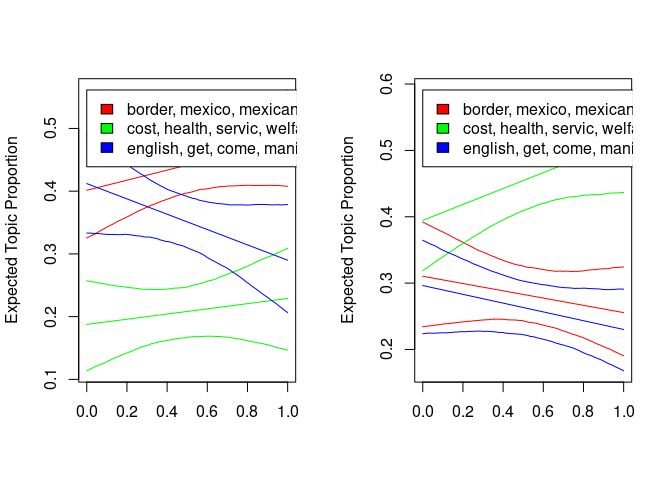
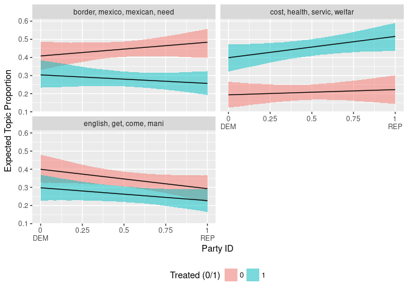

<!-- README.md is generated from README.Rmd. Please edit that file -->
### tidystm: Extract (tidy) effect from `estimateEffect` in the [stm package](http://www.structuraltopicmodel.com/)

[](https://travis-ci.org/) [](https://ci.appveyor.com/project/mikaelpoul/tidystm)

Extracts the effect of a covariate on a set of topics selected by the user. Different effect types available depending on type of covariate. Before running this, the user should run a function to simulate necessary confidence intervals. See `estimateEffect` of the [stm package](http://www.structuraltopicmodel.com/).

#### Install

You need the `devtools` package in order to install `tidystm`. You can install it using the follow code (note that you only need to run this once):

``` r
if (!require(devtools)) install.packages("devtools")
#> Loading required package: devtools
```

You can then install `tidystm` by running:

``` r
devtools::install_github("mikaelpoul/tidystm", dependencies = TRUE)
```

#### Use

The package, for now, includes one function: `extract.estimateEffect()`. You run it just as you would run the `plot.estimateEffect()` function included in the `stm` package. E.g.:

``` r
## Load the packages and set seed
library(stm)
#> stm v1.1.3 (2016-01-14) successfully loaded. See ?stm for help.
library(tidystm)

set.seed(2016)

## Load the example data from the stm pacakge
data(gadarian)

## Estimate the effect on all three topics and return the point
## estimates in a tidy data frame
prep <- estimateEffect(1:3 ~ treatment, gadarianFit, gadarian)
effect <- extract.estimateEffect(prep, "treatment", model = gadarianFit, method = "pointestimate")

knitr::kable(effect)
```

| method        |  topic| covariate |  covariate.value|   estimate|  std.error|  ci.level|   ci.lower|   ci.upper| label                       |
|:--------------|------:|:----------|----------------:|----------:|----------:|---------:|----------:|----------:|:----------------------------|
| pointestimate |      1| treatment |                1|  0.2804612|  0.0206076|      0.95|  0.2402753|  0.3201613| Topic 1(Covariate Level: 1) |
| pointestimate |      1| treatment |                0|  0.4439191|  0.0236996|      0.95|  0.3987170|  0.4904847| Topic 1(Covariate Level: 1) |
| pointestimate |      2| treatment |                1|  0.4569280|  0.0229809|      0.95|  0.4121723|  0.5011797| Topic 2(Covariate Level: 1) |
| pointestimate |      2| treatment |                0|  0.2099581|  0.0214375|      0.95|  0.1670091|  0.2519835| Topic 2(Covariate Level: 1) |
| pointestimate |      3| treatment |                1|  0.2629073|  0.0196289|      0.95|  0.2244965|  0.3043431| Topic 3(Covariate Level: 1) |
| pointestimate |      3| treatment |                0|  0.3459851|  0.0225885|      0.95|  0.3024164|  0.3903011| Topic 3(Covariate Level: 1) |

You can then use the results however you like. This is especially helpful if you want to plot it for yourself when the included plot functions doesnt cut it. For example:

``` r

## This time, lets estimate treatment effect as a function of party
## id. We can than get an idea of whether the treatment effect vary
## for people with different ids.
prep <- estimateEffect(formula = 1:3 ~ treatment + pid_rep + treatment:pid_rep,
                       stmobj = gadarianFit,
                       metadata = gadarian)

## And lets plot it using the included plotting function.
op <- par(mfrow = c(1, 2))
for (i in c(0, 1)) {
  plot.estimateEffect(x = prep,
                      covariate = "pid_rep",
                      method = "continuous",
                      model = gadarianFit,
                      labeltype = "frex",
                      n = 4,
                      moderator = "treatment",
                      moderator.value = i)
}
```



``` r
par(op)
```

Not very easy to see what going on. Instead, lets extract the estimates in a tidy format so that we can plot it ourselves

``` r
## Lets extract the estimates in a tidy format so that we can plot it
## ourselves. We can now use lapply instead to first run it with
## moderator.value 0 and then with moderator.value 1, and then bind
## the two data frames together.
effect <- lapply(c(0, 1), function(i) {
  extract.estimateEffect(x = prep,
                         covariate = "pid_rep",
                         method = "continuous",
                         model = gadarianFit,
                         labeltype = "frex",
                         n = 4,
                         moderator = "treatment",
                         moderator.value = i)
})
effect <- do.call("rbind", effect)

## And, for example, plot it with ggplot2 and facet by topic instead.
library(ggplot2)

ggplot(effect, aes(x = covariate.value, y = estimate,
                   ymin = ci.lower, ymax = ci.upper,
                   group = moderator.value,
                   fill = factor(moderator.value))) +
  facet_wrap(~ label, nrow = 2) +
  geom_ribbon(alpha = .5) +
  geom_line() +
  scale_x_continuous(labels = function(x) ifelse(x == 1, "1\nREP", ifelse(x == 0, "0\nDEM", x))) +
  labs(x = "Party ID",
       y = "Expected Topic Proportion",
       fill = "Treated (0/1)") +
  theme(legend.position = "bottom")
```



Much better :)
